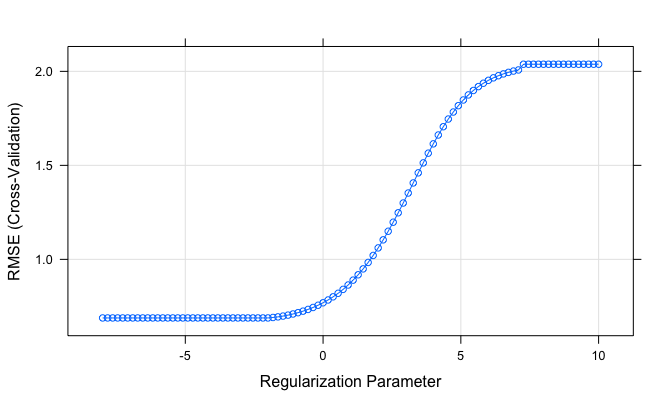
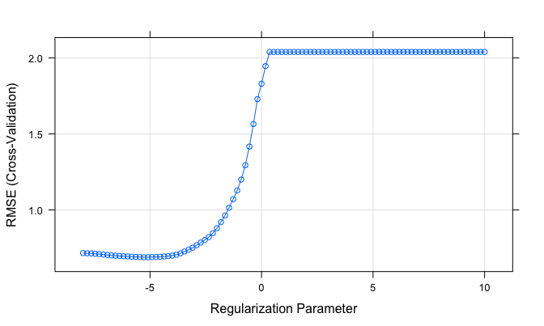
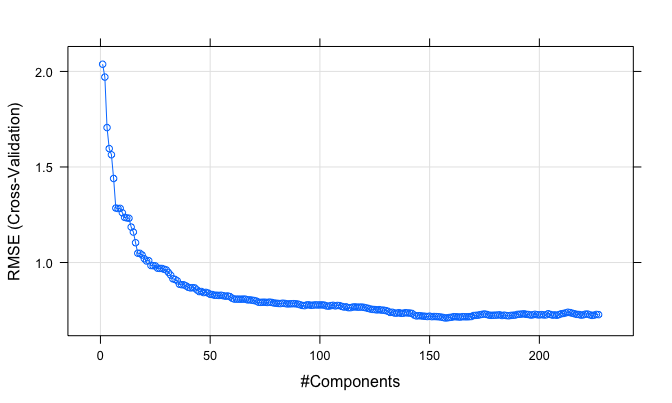

HW1
================
JunLu
2/21/2019

Overview
--------

In this exercise, we will predict solubility of compounds using their chemical structures. The training data are in the file “solubility train.csv” (951 observations) and the test data are in “solubility test.csv” (356 observations). Among the 228 predictors, 208 are binary variables that indicate the presence or absence of a particular chemical substructure, 16 are count descriptors, such as the number of bonds or the number of bromine atoms, and 4 are continuous descriptors, such as molecular weight or surface area. The response is in the column “Solubility” (the last column).

Import the data
---------------

``` r
# Import the train data
train = read_csv("./data/solubility_train.csv")
# Import the test data
test = read_csv("./data/solubility_test.csv")
```

Set random seed
---------------

``` r
set.seed(123)
```

Solutions
---------

#### a.Fit a linear model

##### (1) Fit a linear model using least squares on the training data

``` r
lm_fit = lm(train$Solubility ~ ., data = train)
# summary(lm_fit)
# There are too many predicators so I do not show the result
# par(mfrow=c(2,2))
# plot(lm_fit)
```

##### (2) Calculate the mean square error using the test data.

``` r
train_mse = mean(lm_fit$residuals^2)
train_mse
```

    ## [1] 0.2316799

``` r
test_mse = mean((test$Solubility - predict(lm_fit, test)) ^ 2)
test_mse
```

    ## [1] 0.5558898

The mean square error using the train data is 0.2316799 and the mean square error using the test data is 0.5558898.

#### b. Fit a ridge regression model on the training data, with lambda chosen by cross-validation. Report the test error.

##### (1) Fit a ridge regression model

``` r
train_X = model.matrix(Solubility~.,train)[,-1]
train_Y = train$Solubility
train_control = trainControl(method = "cv",number = 10)
ridge_fit = train(
    x = train_X,
    y = train_Y, 
    method = 'glmnet',
    tuneGrid = expand.grid(alpha = 0,lambda = exp(seq(-8, 10, length = 100))),
    trControl = train_control,
    metric = 'RMSE'
)

ridge_fit$bestTune
```

    ##    alpha    lambda
    ## 33     0 0.1128362

``` r
plot(ridge_fit, xTrans = function(x)log(x))
```



``` r
# coef(ridge_fit$finalModel, ridge_fit$bestTune$lambda)
# No one variable is dropped from the ridge model, however parameters all become smaller.
```

##### (2) Report the test error

``` r
test_X = model.matrix(Solubility~.,test)[,-1]
test_Y = test$Solubility
ridge_predict_Y = predict.train(ridge_fit, test_X)
ridge_test_mse = mean((test_Y - ridge_predict_Y)^2)
ridge_test_mse
```

    ## [1] 0.5134603

The chosen *λ* is 0.1128362. The mean square error using the test data is 0.5134603.

#### c. Fit a lasso regression model on the training data, with lambda chosen by cross-validation. Report the test error.

##### (1) Fit a lasso regression model

``` r
lasso_fit = train(
    x = train_X,
    y = train_Y, 
    method = 'glmnet',
    tuneGrid = expand.grid(alpha = 1,lambda = exp(seq(-8, 10, length = 100))),
    trControl = train_control
)
lasso_fit$bestTune
```

    ##    alpha      lambda
    ## 16     1 0.005129602

``` r
plot(lasso_fit, xTrans = function(x)log(x))
```



``` r
# coef(lasso_fit$finalModel, lasso_fit$bestTune$lambda) 
# A list of variables are shrunken to 0.
```

##### (2) Report the test error

``` r
lasso_predict_Y = predict.train(lasso_fit, test_X)
lasso_test_mse = mean((test_Y - lasso_predict_Y)^2)
lasso_test_mse
```

    ## [1] 0.4962503

The chosen *λ* is 0.005129602. The mean square error using the test data is 0.4962503.

#### d. Fit a PCR model on the training data, with M chosen by cross-validation. Report the test error, along with the value of M selected by cross-validation.

##### (1) Fit a pcr model

``` r
pcr_fit = train(
    x = train_X,
    y = train_Y, 
    method = 'pcr',
    tuneLength = length(train) - 1,
    trControl = train_control,
    scale = TRUE
)
plot(pcr_fit)
```



``` r
pcr_fit$bestTune
```

    ##     ncomp
    ## 157   157

##### (2) Report the test error

``` r
pcr_predict_Y = predict.train(pcr_fit, test_X)
pcr_test_mse = mean((test_Y - pcr_predict_Y)^2)
pcr_test_mse
```

    ## [1] 0.549917

The chosen number of components is 157. The mean square error using the test data is 0.549917.

#### e. Briefly discuss the results obtained in a~f

``` r
mse_table = tibble(
    metric = 'Test MSE',
    linear_model =  0.5558898,
    ridege = 0.5134603,
    lasso = 0.4962503,
    pcr = 0.549917 
)

mse_table %>% knitr::kable(digits = 4)
```

| metric   |  linear\_model|  ridege|   lasso|     pcr|
|:---------|--------------:|-------:|-------:|-------:|
| Test MSE |         0.5559|  0.5135|  0.4963|  0.5499|

By comparing the test mean square errors, we can see that the linear regression model performs worst and the principle component regression model also performs badly in the test data. The lasso model performs best and the ridge model also performs good.

Linear Regression Model: It keeps all variables without any constrain in the model and when some variables are corrlated there is a high variance problem.

Principal Componet Regression: Use a small number of linear combinations of the original inputs.

Ridge Model: Shrink and keep all variables .

Lasso Model: Shrink some variables to 0.(Can be used to do features selection)
